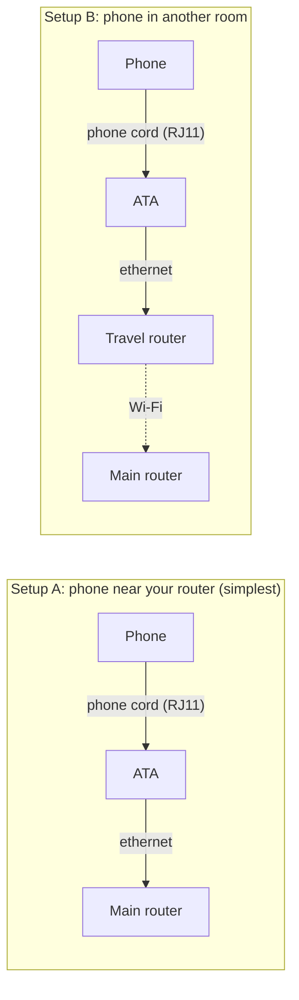
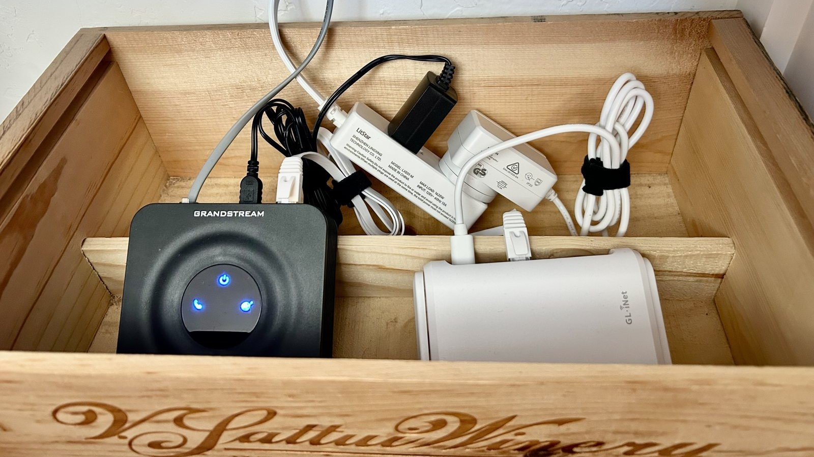

# Home Phone

**A \~$50 DIY landline for the house. No subscription. No screen.**


Home Phone is a project to help you install your own old-school corded telephone at home. You don't need another $20/mo subscription or account with Comcast (God forbid), it works through the internet. It's not technically a landline, but basically works like one except that it runs over your home's internet connection. The phone gets wired through a small adapter to a pay-as-you-go internet phone service. It rings. It has a dial tone. A kid can pick it up and call grandparents or their best friend, with nobody handing them a smartphone.

There's no code in this repo and there's none you need to worry about. This project is primarily a parts list, a diagram for how these parts come together, and a setup guide. I created this mostly as a guide written for AI assistants (Claude, ChatGPT, etc.) to help them walk you through how to set it up.

#### Wanna go now? Drop into Chat/Claude:

>I want to build a DIY landline following this repo: https://github.com/altrickter/home-phone . Read AGENTS.md (a note from the author for assistants). Walk me through it one step at a time: ask me a couple of setup questions first, then give me each step only when I've finished the previous one. 

## Why bother?

- **It's good for kids.** They get to receive and make calls to friends and family on their own, learn phone etiquette. Importantly, without a screen distraction, apps, or a data plan. Kids love that it's a phone they get to answer when it rings.
- **It's good for you.** When there's a house phone, you can turn your own phone off, leave it in a drawer, use Focus mode, or just lose it in the couch, and family can still reach the house. I've used it a few times in a pinch when I needed to get a hold of someone at the house and my wife wasn't picking up her cell.
- **It's cheap.** Popular "kid phone" or "home phone" products run roughly $100 for the device plus \~$10/month. This setup was about $50 in hardware once with a prepay setup at a penny per minute (I've spent only **\~$30 in prepay credit over two years**, covering call time and a $1.10/mo fee for the phone number).
- **It's fun.** A thrift-store push-button phone is a great object, and there's real satisfaction in hearing a dial tone come out of something you wired up yourself.

Just one man's opinion.

## How it works (30-second version)

```
Old phone ──(phone cord)──> ATA ──(ethernet)──> your router ──> internet ──> VoIP provider ──> the phone network
```

- The **phone** is any ordinary analog telephone with a standard phone jack. Find an old phone that's calling your name (thrift it, eBay, your parents' garage).
- The **ATA** (Analog Telephone Adapter) is a small box that turns the analog phone signal into internet packets. It's the only "new" piece of tech.
- The **VoIP provider** gives you a real phone number and connects your calls to the regular phone network. I use [voip.ms](https://voip.ms) because it has **no monthly subscription**: you prepay a small balance, a local number is about a dollar a month, and calls are about a penny a minute. Any SIP provider works with this hardware.
- Optionally, a **travel router** lets you put the phone in a room far from your main router by bridging over Wi-Fi.

### Wiring



Both the ATA and the travel router need a wall outlet. I'd recommend getting Setup A working first, then move to B if you want it.



*Everything that isn't the phone lives in a wine box on the shelf below it: the ATA (blue lights), the travel router (white), and a power strip.*

## What it costs

Approximate US prices as of August 2026. Check current listings; model numbers get refreshed every couple of years.

| Part | What I used | Approx. cost |
|---|---|---|
| Analog phone (RJ11 jack) | Thrifted retro phone | $10–30 |
| Phone line cord (RJ11) | [Generic cord](https://www.amazon.com/dp/B00006HSK6) | \~$5 |
| ATA | [Grandstream HT801 v2](https://www.amazon.com/dp/B0DPZSNL8K) | \~$35 |
| Ethernet cable | Whatever you have | $0–5 |
| **Minimum hardware total** | | **\~$50–75** |
| Travel router (optional) | [GL.iNet Opal GL-SFT1200](https://www.amazon.com/dp/B09N72FMH5) | \~$40 |
| **With travel router** | | **\~$90–115** |

Service (voip.ms, pay-as-you-go): a local phone number is about **$1.10/month** and calls are about **$0.01/minute** to the US and Canada. You prepay a small balance and it just drains slowly. For a kid's phone this works out to a few dollars a month, total. There is nothing particularly special about this service other than it was the cheapest I could find and a pretty adaptable to this type of thing.

I have no affiliation with any product or service mentioned here and none of the links are affiliate links. These are just the parts and provider that have worked well for me. See [HARDWARE.md](HARDWARE.md) for the "just tell me what to buy" list and notes on substitutions.

## Get started (two options)

**1. Chat walkthrough — most people should do this.** The hard part of this project isn't the wiring, it's the jargon-filled configuration in the VoIP provider's portal and the settings page on the adapter. An assistant translates and tells you what to click, and if you get stuck you can drop it a screenshot to troubleshoot. Paste this into Claude, ChatGPT, or similar:

> I want to build a DIY landline following this repo: https://github.com/altrickter/home-phone . Read AGENTS.md (a note from the author for assistants). Walk me through it one step at a time: ask me a couple of questions first, then give me each step only when I've finished the previous one. Use the repo's shopping list rather than searching for products.

Once you have the gear, plan on this taking about 1-2 hours the first time, most of it clicking through settings.

**2. Drive it yourself.** Read [GUIDE.md](GUIDE.md). It links to the manufacturers' own guides for the click-by-click parts and adds the settings, decisions, and gotchas they don't tell you. [AGENTS.md](AGENTS.md) is the note the assistants read: what matters most, a suggested step-by-step structure, and the decisions you'll need to make.

## Please take note

- **911.** Pay-as-you-go VoIP is not a traditional landline with built in 911 service. With voip.ms you can either pay \~$1.50/month for E911 service, or skip it and register your address anyway, in which case a 911 call still connects but costs a one-time $75 fee. Either way, make sure you know what this phone does and doesn't do in an emergency. Read the provider's current policy; it changes.
- **No power, no phone.** Unlike an old copper landline, this needs your internet and power to be working.

## Repo layout

```
README.md      this file
GUIDE.md       the full setup guide: steps, settings, questions, troubleshooting
HARDWARE.md    parts list, alternatives, and what matters if you substitute
VOIPMS.md      map of the voip.ms portal: where every setting lives and what to put in it
AGENTS.md      the note for AI assistants: what matters, suggested structure
CLAUDE.md      just "@AGENTS.md" — forces Claude Code to load AGENTS.md
CONTRIBUTING.md  how to send a field report or correction
images/        photos and diagrams
```

## Contributing

If you build one with different hardware, a different provider, or in a different country, open a **field report issue** with what you used and what tripped you up — no pull request needed, and the issues list doubles as a searchable knowledge base for the next builder. Corrections (a price changed, a menu moved) are equally welcome. See [CONTRIBUTING.md](CONTRIBUTING.md).

## License

[CC BY 4.0](LICENSE). Use it, adapt it, share it, just credit the source.
